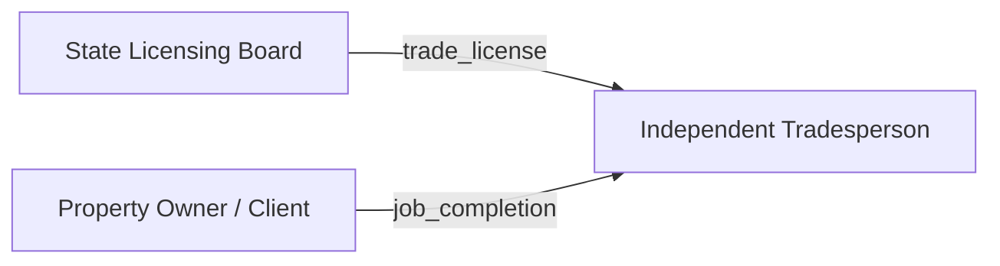

# Ecosystem Package Skill

## When to Use

Use this skill when the user asks to:
- Build ecosystem pages from a design (`/ecosystem-package build [name]`)
- List available ecosystems (`/ecosystem-package list`)
- Rebuild pages after artifact changes (`/ecosystem-package rebuild [name]`)
- Regenerate the ecosystem index (`/ecosystem-package index`)

## Commands

### `/ecosystem-package list`

1. Glob for `docs/*/ecosystem.yaml`
2. For each match, read the `ecosystem.display_name` and `ecosystem.description` from the YAML
3. Print a summary table: name, display name, role count, credential count

### `/ecosystem-package build [name]`

1. Read `docs/{name}/ecosystem.yaml`
2. Generate two pages:
   - `docs/ecosystems/{name}.md` — Overview page with Mermaid diagrams
   - `docs/ecosystems/{name}-credentials.md` — Credential catalog page
3. Regenerate `docs/ecosystems/index.md` (run the index command)
4. Show the user a summary of what was generated

### `/ecosystem-package rebuild [name]`

Same as `build` — overwrites existing generated pages.

### `/ecosystem-package index`

1. Glob for all `docs/ecosystems/*.md` files (excluding index.md and *-credentials.md)
2. Read frontmatter from each
3. Regenerate `docs/ecosystems/index.md`

## Voice Guidelines

Ecosystem pages follow the KERI.host voice. Key points:

- **Conversational but substantive.** Explain to a smart reader, not an academic or marketer.
- **Anti-hype.** No breathless language. If something is a design (not built yet), say so.
- **Credentials are examples.** Always note that credentials and schemas are illustrative examples, not finalized specifications.
- **Grounded in architecture.** Every claim maps to a credential, role, or delegation tree in the YAML.
- **No crypto buzzwords** without immediately grounding them in human outcomes.
- **No emojis.** Clean, professional markdown.
- **Direct address.** "You" not "users" or "stakeholders."

## Pattern Vocabulary

Use these terms consistently (same as blog skill):

| Term | Meaning |
|------|---------|
| **No Central Workflow** | Systems where no single entity controls the process |
| **Delegated AI** | AI agents with cryptographically scoped, revocable authority |
| **Subjective Reputation** | Reputation that is community-defined, contextual, and plural |
| **Ecosystem Autonomy** | Each community governs itself; KERI.host provides infrastructure, not governance |
| **OADA** | Offer, Accept, Disclose, Attest — the four-step interaction pattern |
| **Data at the Edge** | Data stays with the individual, not in central databases |
| **Signing at the Edge** | Cryptographic operations happen on the user's device |

## Page Generation: Overview Page

**File:** `docs/ecosystems/{name}.md`

### Frontmatter Template

```markdown
---
title: "{display_name}"
permalink: /ecosystems/{name}/
layout: single
author_profile: true
toc: true
toc_sticky: true
description: "{First sentence of ecosystem.description}"
---
```

### Content Structure

Generate the following sections in order. Diagrams come first (the visual hook), roles go at the bottom (reference material). The sticky TOC sidebar lets readers jump to any section.

#### 1. Introduction

Write 2-3 paragraphs summarizing the ecosystem from `ecosystem.description`. Use the KERI.host voice — conversational, grounded, anti-hype. Mention this is an ecosystem design (conceptual, not yet implemented). Note that credentials and schemas are illustrative examples, not finalized specifications.

#### 2. Role Interaction Map (Mermaid Diagram)

Generate a Mermaid `graph LR` diagram showing:
- Each role as a node (use `display_name`)
- Edges representing credential flows: `issuer_role --> |credential_name| holder_role`
- Derive edges from `credential_catalog[]` — each credential creates an edge from its `issuer_role` to its `holder_role`
- Skip credentials where `issuer_role` is an external ecosystem (not in `roles[]`)
- Use meaningful node IDs derived from role names (e.g., `tradesperson`, `homeowner`)

Example structure:
````markdown

````

**Important Mermaid rules:**
- Node IDs must not contain spaces or special characters (use underscores)
- Use quoted strings for display labels: `nodeId["Display Label"]`
- Edge labels use `|label text|` syntax
- Keep edge labels short (credential name, not full description)
- If the diagram has more than 15 edges, split into sub-diagrams by category

#### 3. Credential Issuance Flow (Mermaid Diagram)

Generate a Mermaid `graph TD` (top-down) diagram showing:
- Issuer roles at the top
- Holder roles at the bottom
- Arrows from issuer to holder labeled with credential name
- Group by issuer role to show who issues what
- Only include credentials where both issuer and holder are in `roles[]`

#### 4. Delegation Trees (Mermaid Diagram)

Generate a Mermaid `graph TD` diagram from `delegation_trees[]`:
- Root role at the top
- Delegated roles below, connected with edges labeled with scope (abbreviated)
- Show `depth_limit` in the edge label if > 1
- One sub-diagram per delegation tree, or combine if they share root roles

#### 5. Credential Dependency Graph (Mermaid Diagram)

Generate a Mermaid `graph LR` diagram from `credential_catalog[].chained_from`:
- Each credential as a node
- Arrow from `chained_from` credential to the dependent credential
- Only include credentials that participate in chains (have a non-null `chained_from` or are referenced by another credential's `chained_from`)
- Label nodes with credential display name

#### 6. Governance

Summarize `governance.regulatory_frameworks`, `governance.privacy_requirements`, and `governance.dispute_resolution` in narrative paragraphs. Don't just list them — weave them into a story about how the ecosystem governs itself.

#### 7. Interoperability

For each entry in `interoperability[]`, write a short paragraph about the bridge to that ecosystem and what flows across the boundary. List bridge credentials.

#### 8. Roles

For each role in `roles[]`:
- Display name as `###` heading
- 1-2 sentence description drawn from the YAML `description` field, rewritten in the KERI.host voice (not copied verbatim)
- A compact table of KERI infrastructure requirements (witness pool, watcher network, agent service, ACDC registry)
- List governance obligations as bullet points

#### 9. Footer

Add:
```markdown
---

*This is an ecosystem design — a conceptual architecture, not a running system. Credentials and schemas are illustrative examples, not finalized specifications. See the [credential catalog](/ecosystems/{name}/credentials/) for the full credential specification.*

*Generated from [`docs/{name}/ecosystem.yaml`](https://github.com/seriouscoderone/kerihost/blob/main/docs/{name}/ecosystem.yaml) by the `/ecosystem-package` skill.*
```

## Page Generation: Credentials Page

**File:** `docs/ecosystems/{name}-credentials.md`

### Frontmatter Template

```markdown
---
title: "{display_name} — Credentials"
permalink: /ecosystems/{name}/credentials/
layout: single
author_profile: true
toc: true
toc_sticky: true
description: "Complete credential catalog for the {display_name} ecosystem."
---
```

### Content Structure

#### 1. Introduction

One paragraph: "This is the complete credential catalog for the {display_name} ecosystem. Each credential below includes its issuer, holder, verifiers, schema fields, disclosure mode, and chaining relationships. Credentials and schemas are illustrative examples showing the type of data each credential would carry, not finalized specifications."

Add a link back to the overview: `[Back to {display_name} overview](/ecosystems/{name}/)`

#### 2. Credential Entries

For each credential in `credential_catalog[]`, generate:

```markdown
### {credential.name}

{credential.description — rewritten in KERI.host voice, 1-2 sentences}

| Property | Value |
|----------|-------|
| **ID** | `{credential.id}` |
| **Issuer** | {issuer_role display_name} |
| **Holder** | {holder_role display_name} |
| **Verifiers** | {comma-separated verifier_role display_names} |
| **Disclosure** | {disclosure_mode} |
| **Chained From** | {chained_from credential name, or "None (root credential)"} |

**Schema Fields:**

| Field | Type | Required |
|-------|------|----------|
| `{field.name}` | {field.type} | {field.required} |
```

#### 3. Footer

```markdown
---

*[Back to {display_name} overview](/ecosystems/{name}/)*

*Generated from [`docs/{name}/ecosystem.yaml`](https://github.com/seriouscoderone/kerihost/blob/main/docs/{name}/ecosystem.yaml) by the `/ecosystem-package` skill.*
```

## Page Generation: Index Page

**File:** `docs/ecosystems/index.md`

### Frontmatter

```markdown
---
title: "Ecosystems"
permalink: /ecosystems/
layout: single
author_profile: true
description: "KERI ecosystem designs — real communities, real credentials, real architecture."
---
```

### Content

```markdown
Ecosystem designs are conceptual architectures that map out how KERI credentials, roles, and governance work together for specific communities. Each design is a complete specification — roles, credentials, delegation trees, and interoperability — ready to be implemented. Credentials and schemas are illustrative examples, not finalized specifications.

These are not whitepapers. They are buildable blueprints.
```

Then for each ecosystem (read from the overview pages' frontmatter):

```markdown
### [{display_name}](/ecosystems/{name}/)

{ecosystem.description — first 2 sentences}

**{role_count} roles** · **{credential_count} credentials** · [View credentials](/ecosystems/{name}/credentials/)
```

## Mermaid Diagram Guidelines

1. **Always use quoted display labels** for nodes: `nodeId["Display Label"]`
2. **Keep edge labels short** — use credential IDs or abbreviated names, not full descriptions
3. **Use `graph LR`** for interaction maps and dependency graphs (left-to-right)
4. **Use `graph TD`** for issuance flows and delegation trees (top-down)
5. **Wrap in fenced code blocks** with `mermaid` language tag
6. **Test that node IDs are valid** — alphanumeric and underscores only
7. **If a diagram exceeds ~20 nodes**, consider splitting into focused sub-diagrams with clear section headings
8. **External roles** (issuer roles not in `roles[]`, like `insurance_ecosystem` or `financial_institution`) should be shown as dashed-border nodes: `ext_role["External: Insurance"]:::external` with a classDef

### Mermaid Class Definitions

Add at the top of diagrams that include external roles:
```
classDef external fill:#f9f9f9,stroke:#999,stroke-dasharray: 5 5
```

## Process Checklist

When running `build` or `rebuild`:

- [ ] Read the ecosystem.yaml fully
- [ ] Resolve all role name references (map `issuer_role` strings to `roles[].display_name`)
- [ ] Handle external roles gracefully (roles referenced in credentials but not defined in `roles[]`)
- [ ] Generate all 4 Mermaid diagrams
- [ ] Verify Mermaid syntax (no spaces in node IDs, quoted labels, valid edge syntax)
- [ ] Write overview page
- [ ] Write credentials page
- [ ] Regenerate index page
- [ ] Report summary to user
