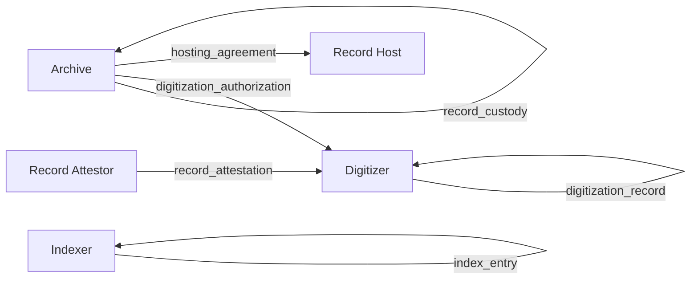
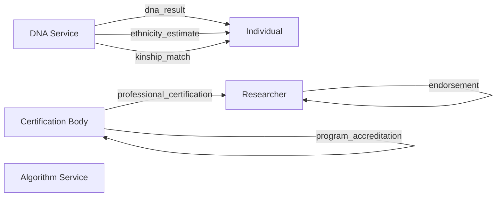
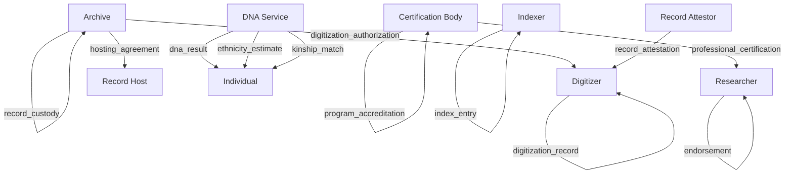
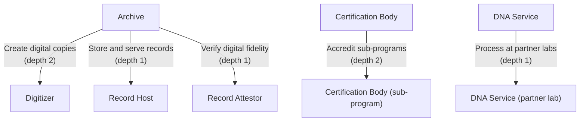
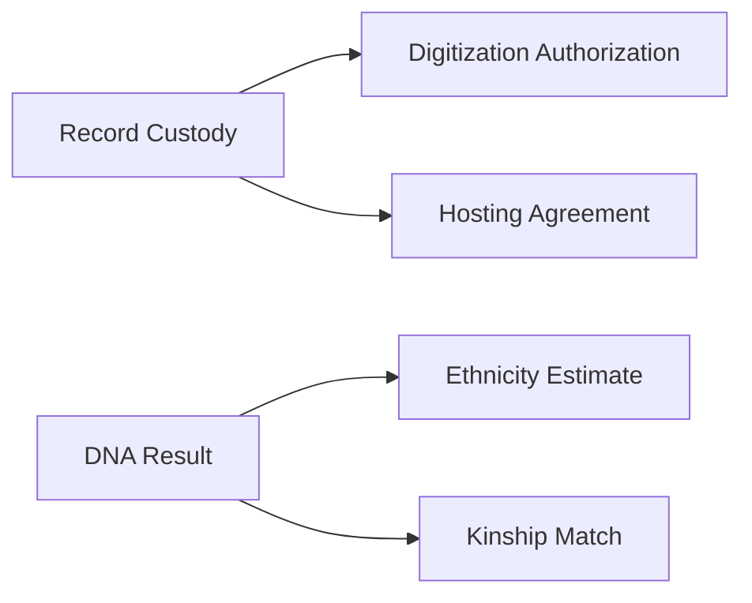

## What This Is

Right now, your family history research lives inside whatever platform you use to do it. Ancestry owns your tree, your saved records, your hints, your DNA matches. FamilySearch is better on the ownership front — they're a nonprofit — but the data still lives in their silo. If you've spent twenty years building a family tree, that tree is only as portable as a GEDCOM export, which is to say: barely.

This ecosystem design restructures genealogy around the evidence itself. Individuals own their research as portable, signed artifacts — family trees, source citations, DNA interpretations, and narrative histories — that carry provenance from source archives through researchers to families. Record repositories issue verifiable credentials for digitized documents. Professional genealogists hold accreditation credentials that chain to certifying bodies. DNA testing results are held by the individual with selective disclosure, not stored by platforms. Research conclusions carry proof chains showing the evidence and methodology behind them, enabling peer review without platform lock-in.

This is an ecosystem design — a conceptual architecture, not a running system. Credentials and schemas shown are illustrative examples showing the type of data each credential would carry, not finalized specifications. Everything here maps to specific roles, credentials, and delegation trees defined in the [ecosystem YAML](https://github.com/seriouscoderone/kerihost/blob/main/docs/genealogy/ecosystem.yaml). The diagrams below are generated from that specification.

## Role Interaction Map

This ecosystem has 16 credentials flowing between 10 roles. Split into two views for readability.

### Records and Provenance

How physical records become searchable digital data. Archives authorize digitization, digitizers create copies, attestors verify fidelity, indexers make records searchable, and hosts serve them.

### Research, Credentials and DNA

How knowledge is created from records. Researchers make claims and resolve identities. Certification bodies credential professionals. DNA services issue results to individuals. Disputes and endorsements are visible in the public claim graph.

Note: Individuals also issue dispute claims and endorsements (same credential types as researchers), but at a lighter weight — reacting to claims rather than producing original research. Algorithm services consume the claim graph but don't issue credentials.

## Credential Issuance Flow

Who issues what to whom, organized top-down by authority level. Self-referencing credentials (archive issuing record custody to itself, researcher issuing claims to themselves) represent self-attested credentials that others then verify.

## Delegation Trees

Authority flows from three roots. Archives are the primary trust anchor for the records provenance chain, delegating digitization, hosting, and attestation authority. Certification bodies can accredit sub-programs, creating a hierarchy of professional credentialing. DNA services can delegate to partner laboratories.

The archive delegation tree has depth 2 for digitizers, meaning an archive can authorize a digitization company, who can in turn authorize sub-contractors — creating verifiable chains of custody for large-scale digitization projects.

## Credential Dependency Graph

Two independent chains. The **records provenance chain** starts with record custody — proving an archive holds the originals — which unlocks digitization authorization and hosting agreements. The **DNA chain** starts with raw DNA results, which feed into ethnicity estimates and kinship matches. Everything else is a root credential (unchained).

## Governance

This ecosystem operates within a patchwork of existing regulations rather than inventing its own governance. State genetic privacy laws (Maryland, Montana, California, Utah, Arizona) define what can be done with DNA data. GINA protects against genetic discrimination in employment and health insurance. State vital records access laws control who can see birth, death, and marriage records — and when. State adoption record sealing statutes add another layer of access control. Indigenous and tribal records sovereignty requirements must be respected. Copyright law applies to digitized expressions of records (the scan itself may be copyrighted) while the underlying facts are not copyrightable.

Privacy is structural, not bolted on. DNA credentials use selective disclosure — you prove specific genetic facts without revealing your full profile. Living people are notified when identified in records and can accept, dispute, or request removal. Time-locked disclosure handles sensitive records: for a defined period after death, only the fact of existence is visible (selective disclosure), while full details remain sealed until conditions are met — the time window expires and records are verified for release. This creates a breadcrumb trail for researchers: you can see a record exists, know when it becomes available, and plan your research accordingly. The privacy hierarchy is explicit: regulation overrides record holder preferences, which override individual preferences. Facts extracted from records are not copyrightable and belong to the researcher; digitization expressions (photos, scans) may carry copyright controlled by the digitizer.

The ecosystem does not enforce disputes or impose liability. All actions are signed and attributable. Disputes are expressed as signed dispute claim credentials visible in the public claim graph. Endorsements are signed endorsement credentials. Consensus emerges from the visible balance of disputes and endorsements — not from a central authority declaring truth. Algorithm services compute corroboration scores from this data. Individuals decide what to trust. If actions violate law, the signed audit trail provides evidence for external legal proceedings. This is genealogy's version of peer review, except the review process is cryptographically transparent.

## Interoperability

### Identity

The genealogy ecosystem consumes identity credentials for living person verification. When a record references a living person, notification requires bridging to an identity ecosystem for contact resolution. Death record verification may originate from identity or vital records ecosystems. Bridge credentials: `individual identity verification`.

## Roles

### Archive

Custodian of original physical records — county courthouses, churches, national archives, libraries, historical societies. The root authority in the provenance chain. Issues record custody credentials and authorizes digitization of their collections.

| Witness Pool | Watcher Network | Agent Service | ACDC Registry |
|:---:|:---:|:---:|:---:|
| Yes | No | Yes | Yes |

- Maintain witness pool with >= 3 witnesses for high-value attestations
- Publish OOBI endpoints for record custody credential verification
- Revoke digitization authorizations when terms are violated

### Digitizer

Creates digital copies of physical records. Ranges from professional scanning companies to individual volunteers photographing gravestones. Issues digitization record credentials with provenance back to the source object.

| Witness Pool | Watcher Network | Agent Service | ACDC Registry |
|:---:|:---:|:---:|:---:|
| No | No | Yes | Yes |

- Digitization credentials must reference the source object
- Must disclose capture method and conditions (scan resolution, photo angle, etc.)
- Must honor copyright terms of digitization authorizations

### Indexer

Transcribes and tags digitized records to make them searchable. May be volunteers, professionals, or AI services. Issues index entry credentials linking transcribed data to the digitization records they were derived from.

| Witness Pool | Watcher Network | Agent Service | ACDC Registry |
|:---:|:---:|:---:|:---:|
| No | No | Yes | Yes |

- Index entries must reference the digitization record they were derived from
- Must disclose transcription method (manual, AI-assisted, fully automated)

### Record Attestor

Verifies the fidelity of a digital copy against its physical original. May be an archive employee, a certified records examiner, or a trusted third party. Strengthens the provenance chain by adding an independent verification layer.

| Witness Pool | Watcher Network | Agent Service | ACDC Registry |
|:---:|:---:|:---:|:---:|
| No | No | Yes | Yes |

- Must have examined or compared the digital copy against the physical original
- Must disclose the basis of attestation (in-person comparison, authorized proxy, etc.)

### Record Host

Stores and serves digital record copies. The decentralized replacement for Ancestry's and MyHeritage's hosting infrastructure. Anyone can be a record host — individuals, companies, nonprofits. Heaviest infrastructure role due to content serving at scale.

| Witness Pool | Watcher Network | Agent Service | ACDC Registry |
|:---:|:---:|:---:|:---:|
| Yes | Yes | Yes | Yes |

- Maintain witness pool with >= 3 witnesses
- Subscribe to watcher network for KEL sync and duplicity detection
- Honor hosting agreement terms (access controls, copyright restrictions)
- Publish OOBI endpoints for hosted collections

### Researcher

Interprets records and makes claims about people and relationships. Ranges from professional genealogists to hobbyists. Issues research claims, identity resolution claims, disputes, and endorsements. Reputation emerges from visible claim history — not from a gatekept certification.

| Witness Pool | Watcher Network | Agent Service | ACDC Registry |
|:---:|:---:|:---:|:---:|
| No | No | Yes | Yes |

- Research claims must reference supporting evidence (digitization records, index entries, etc.)
- Identity resolution claims must state the basis for linking records to the same person

### Individual

Person researching their own family history. Curates a personal genealogy view by accepting or rejecting research claims from others. Owns their research graph, DNA results, and identity links. Lightest infrastructure role.

| Witness Pool | Watcher Network | Agent Service | ACDC Registry |
|:---:|:---:|:---:|:---:|
| No | No | Yes | No |

- Responsible for own key security and backup

### Certification Body

Issues professional credentials for genealogists. Includes certification boards, universities, genealogy institutes, and training programs. Authority is organic and reputation-based — the ecosystem does not anoint any single body as the sole credentialing authority.

| Witness Pool | Watcher Network | Agent Service | ACDC Registry |
|:---:|:---:|:---:|:---:|
| Yes | No | Yes | Yes |

- Maintain witness pool with >= 3 witnesses for credential issuance
- Publish criteria for certification and accreditation
- Revoke certifications when standards are not maintained

### Algorithm Service

Provides corroboration scoring, matching, search indexing, and hint generation over the public claim graph. The decentralized replacement for Ancestry's matching algorithm. Competitive service layer — anyone can build one. Reads the claim graph, computes scores, and presents simplified views.

| Witness Pool | Watcher Network | Agent Service | ACDC Registry |
|:---:|:---:|:---:|:---:|
| No | Yes | Yes | No |

- Subscribe to watcher network for claim graph access
- Disclose scoring methodology (open or proprietary)

### DNA Service

Processes genetic samples and issues DNA result credentials held by the individual, not stored by the platform. Includes ethnicity estimates and kinship matches. Results use selective disclosure — you control what is revealed and to whom.

| Witness Pool | Watcher Network | Agent Service | ACDC Registry |
|:---:|:---:|:---:|:---:|
| Yes | No | Yes | Yes |

- Maintain witness pool with >= 3 witnesses for DNA credential issuance
- DNA result credentials must be issued to the individual, not retained by the service
- Must support selective disclosure for all DNA credentials
- Must comply with applicable genetic privacy laws

---

*This is an ecosystem design — a conceptual architecture, not a running system. Credentials and schemas are illustrative examples, not finalized specifications. See the [credential catalog](/ecosystems/genealogy/credentials/) for the full credential specification.*

*Generated from [`docs/genealogy/ecosystem.yaml`](https://github.com/seriouscoderone/kerihost/blob/main/docs/genealogy/ecosystem.yaml) by the `/ecosystem-package` skill.*
