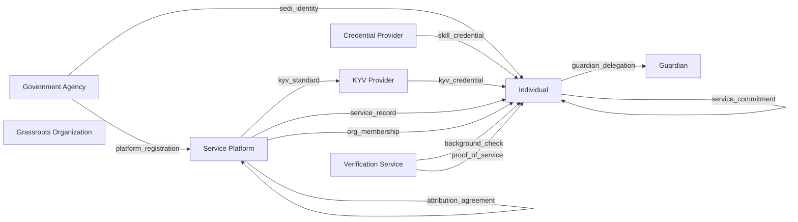
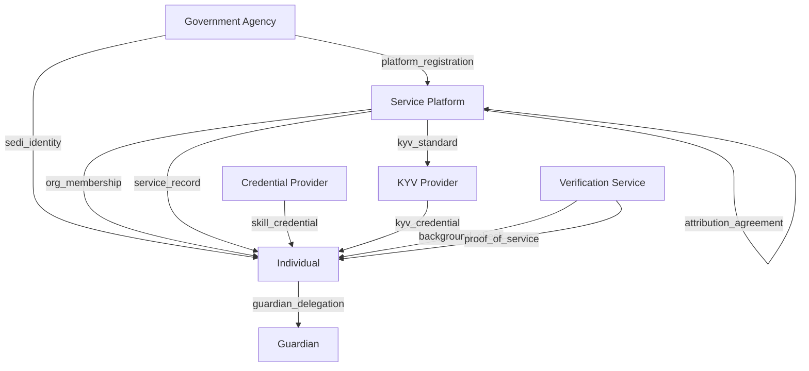
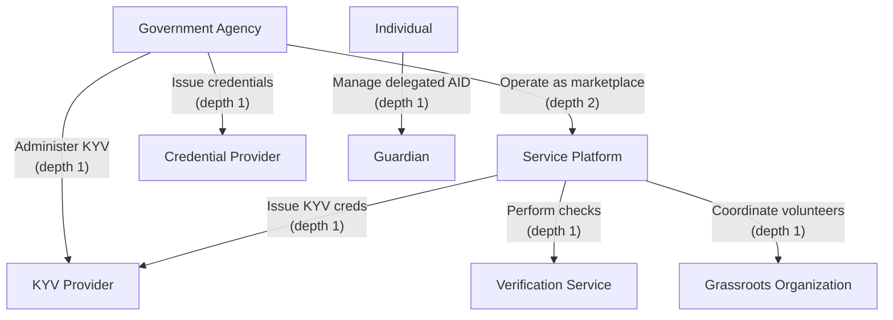
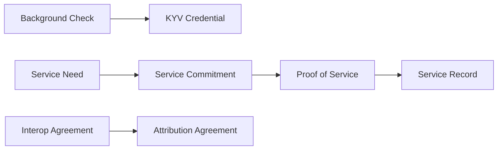

## What This Is

Today, volunteer coordination lives inside organizational silos. The Red Cross tracks its volunteers. United Way tracks its. Your church tracks its. If you volunteer across all three, you have three separate identities, three separate reputations, and no portable record of any of it. The organizations compete for attribution rather than collaborating on outcomes.

This ecosystem design flips that model. Individuals own their identity, credentials, and service history. Organizations participate as peers in a shared marketplace — each credentialing and vetting volunteers according to their own governance, while service opportunities and verified service records flow freely across organizational boundaries. Trust is rooted in verifiable credentials: whoever issues a credential is also responsible for verifying it.

This is an ecosystem design — a conceptual architecture, not a running system. Credentials and schemas shown are illustrative examples showing the type of data each credential would carry, not finalized specifications. Everything here maps to specific roles, credentials, and delegation trees defined in the [ecosystem YAML](https://github.com/seriouscoderone/kerihost/blob/main/docs/humanitarian-service-marketplace/ecosystem.yaml). The diagrams below are generated from that specification.

## Role Interaction Map

All credential flows in the ecosystem. The individual is the center — most credentials flow toward them. Self-asserted credentials (equipment inventory, service need, service commitment) loop back on the individual.

Note: Grassroots organizations also issue service needs, org memberships, and service records (same credential types as service platforms), but at a smaller scale with lighter governance.

## Credential Issuance Flow

Who issues what to whom, organized top-down by authority level. Self-asserted credentials omitted for clarity.

## Delegation Trees

Authority flows from three roots: government agencies for formal organizations, service platforms for ecosystem participants, and individuals for guardianship.

KYV providers have two authority paths: direct delegation from government, or delegated through a service platform. Both are valid. The ecosystem doesn't require you to pick one.

## Credential Dependency Graph

Credentials chain together. A service record requires proof of service, which requires a service commitment, which requires a published service need. This is the OADA pattern (Offer, Accept, Disclose, Attest) encoded in credential dependencies.

Two independent chains: the **service lifecycle chain** (need → commitment → proof → record) forms the core workflow. The **vetting chain** (background check → KYV credential) feeds into volunteer qualification. The **platform governance chain** (interop → attribution) handles cross-organizational accounting.

## Governance

This ecosystem operates within existing regulatory structures rather than inventing its own. State nonprofit reporting requirements and IRS 990 auditing apply to formal organizations, scaling with organizational formality — a neighborhood group publishing needs has different obligations than the Red Cross. Child protection laws require background checks for service involving minors. OSHA regulations apply to physical labor activities. State-Endorsed Digital Identity (SEDI) frameworks, with Utah leading and multi-state adoption underway, provide the foundational identity layer.

Privacy is built into the credential architecture, not bolted on afterward. Volunteer personal data is owned by the individual — organizations receive contractual views, not copies. Service need publications use selective disclosure to protect requester vulnerability. Biometric and location proof-of-service data is exposed only on a selective disclosure basis. Guardian-managed AIDs for minors and vulnerable populations use scope-bounded delegation. Privacy violations are provable via the cryptographic audit trail — law is the enforcement mechanism, and platforms and individuals are bound by legally enforceable contracts governing data use.

Disputes resolve through cryptographic evidence. The KEL/TEL audit trail shows exactly who verified what credentials, who authorized what actions, and what proof-of-service was recorded. Duplicity (equivocation) detected by watchers constitutes automatic grounds for credential suspension. For formal organizations, a governance body convenes a judge/jury panel to evaluate evidence. For grassroots interactions, the cryptographic record itself serves as the basis for any legal proceedings. Liability follows the audit trail — if a platform verified credentials that were fraudulent, the chain shows where fraud originated. If a platform failed to verify, that omission is equally visible.

## Interoperability

### Transportation

Volunteers and requesters connect to transportation ecosystems through driver and vehicle credentials. Ride-sharing for service-related transportation becomes possible when transportation providers can verify volunteer status for priority or subsidized rides. Bridge credentials: `driver_credential`, `vehicle_credential`.

### Tool Sharing

Volunteers discover and borrow tools needed for service work through a tool-sharing ecosystem. Tool owners verify volunteer KYV status before lending high-value equipment — the credential does the trust-building that would otherwise require a personal relationship. Bridge credentials: `tool_listing_credential`, `borrower_reputation`.

### SEDI Digital Identity

State-Endorsed Digital Identity serves as the gold-standard root of trust for the ecosystem. SEDI credentials bootstrap trust for new participants without existing ecosystem reputation — you show up with a government-backed identity and start building from there. Bridge credentials: `sedi_identity`.

### Insurance

Formal service platforms verify liability coverage for high-risk volunteer activities. Insurance providers consume verified service records for risk assessment — a volunteer with a long, verified history is a lower-risk proposition. Bridge credentials: `liability_coverage_credential`, `workers_comp_credential`.

### Tax Reporting

Government agencies receive aggregated, auditable volunteer hour roll-ups. Individuals claim tax deductions backed by cryptographically verified service records — no more self-reported hours on the honor system. Bridge credentials: `service_hour_aggregation`, `tax_deduction_certificate`.

## Roles

### Individual

A person at the center of the ecosystem — can be a requester, a volunteer, or both. Owns their identity, credentials, and service history. May hold a State-Endorsed Digital Identity (SEDI) or bootstrap trust through ecosystem-native KYV credentials.

| Witness Pool | Watcher Network | Agent Service | ACDC Registry |
|:---:|:---:|:---:|:---:|
| No | No | Yes | No |

- Maintain key security for their AID
- Provide truthful self-asserted data (equipment inventory, availability)
- Honor service commitments or revoke them before the commitment window

### Guardian

Manages a delegated AID on behalf of someone who cannot manage their own — a minor, elderly person, or person with disabilities. The ward retains their own AID; the guardian holds a delegated AID that acts within a cryptographically bounded scope. When the ward gains capacity, delegation is revoked and they take full control.

| Witness Pool | Watcher Network | Agent Service | ACDC Registry |
|:---:|:---:|:---:|:---:|
| No | No | Yes | No |

- Act within the scope defined by the guardian delegation credential
- Preserve the ward's AID and transfer control when delegation ends
- Comply with applicable guardianship laws and court orders

### Grassroots Organization

Informal groups — neighborhood clubs, homeschool co-ops, friend networks, small faith communities — that publish needs and coordinate volunteers without formal governance. Same protocols as large platforms, different scale and reputation depth. Permissionless entry.

| Witness Pool | Watcher Network | Agent Service | ACDC Registry |
|:---:|:---:|:---:|:---:|
| No | No | Yes | No |

- Publish service needs accurately
- Honor interoperability agreements with partner organizations
- Comply with legal obligations that scale with organizational formality

### Service Platform

Formal organizations — Red Cross, United Way, faith-based organizations — that operate as marketplace peers. They match volunteers to needs, run Know Your Volunteer programs, and serve as trust anchors. Their value evolves as the ecosystem matures: KYV vetting, disaster coordination at scale, government liaison — rather than simply being middlemen.

| Witness Pool | Watcher Network | Agent Service | ACDC Registry |
|:---:|:---:|:---:|:---:|
| Yes | Yes | Yes | Yes |

- Maintain witness pool with >= 3 geographically distributed witnesses
- Publish OOBI endpoints for discovery
- Operate KYV programs per published standards
- Honor interoperability and attribution agreements with partner platforms
- Report duplicity evidence to governance body
- Comply with nonprofit reporting and tax-exempt auditing requirements

### Credential Provider

Entities that issue skill and training credentials — trade schools, CPR trainers, online education platforms, professional licensing bodies. The issuer is also the verifier: whoever grants the credential is responsible for confirming its validity.

| Witness Pool | Watcher Network | Agent Service | ACDC Registry |
|:---:|:---:|:---:|:---:|
| Yes | No | Yes | Yes |

- Verify credential validity when queried
- Revoke credentials when underlying qualifications expire or are lost
- Maintain credential schemas in the ecosystem schema registry
- Publish OOBI endpoints for credential verification

### KYV Provider

Entities running Know Your Volunteer programs — composing background checks, training certificates, psychological evaluations, and other component credentials into a KYV credential. Multiple KYV standards coexist, each with known strengths and weaknesses. Could be a service platform, a specialized provider, or a consortium.

| Witness Pool | Watcher Network | Agent Service | ACDC Registry |
|:---:|:---:|:---:|:---:|
| Yes | Yes | Yes | Yes |

- Publish the KYV standard definition (what component credentials are required)
- Verify all component credentials before issuing KYV credential
- Revoke KYV credentials when component credentials expire or are revoked
- May require in-person training or other governance structures as they see fit

### Verification Service

Background check providers, identity verification services, biometric verification providers — the component suppliers that feed into KYV and other composite credentials. Specialized providers that serve multiple KYV providers and platforms.

| Witness Pool | Watcher Network | Agent Service | ACDC Registry |
|:---:|:---:|:---:|:---:|
| No | No | Yes | Yes |

- Perform checks according to published standards
- Issue results as verifiable credentials with clear methodology disclosure
- Maintain data privacy per legal and contractual obligations

### Government Agency

Regulatory bodies that issue licenses (SEDI identity, professional licenses), receive tax reporting, and enforce child protection laws. Benefits from KERI's automatic verifiability — reduced accounting overhead, provable compliance. Consumes aggregated, auditable roll-ups of service data.

| Witness Pool | Watcher Network | Agent Service | ACDC Registry |
|:---:|:---:|:---:|:---:|
| Yes | Yes | Yes | Yes |

- Issue SEDI and other government-backed credentials per regulatory standards
- Publish credential schemas and verification endpoints
- Accept and validate aggregated reporting from ecosystem participants

---

*This is an ecosystem design — a conceptual architecture, not a running system. Credentials and schemas are illustrative examples, not finalized specifications. See the [credential catalog](/ecosystems/humanitarian-service-marketplace/credentials/) for the full credential specification.*

*Generated from [`docs/humanitarian-service-marketplace/ecosystem.yaml`](https://github.com/seriouscoderone/kerihost/blob/main/docs/humanitarian-service-marketplace/ecosystem.yaml) by the `/ecosystem-package` skill.*
