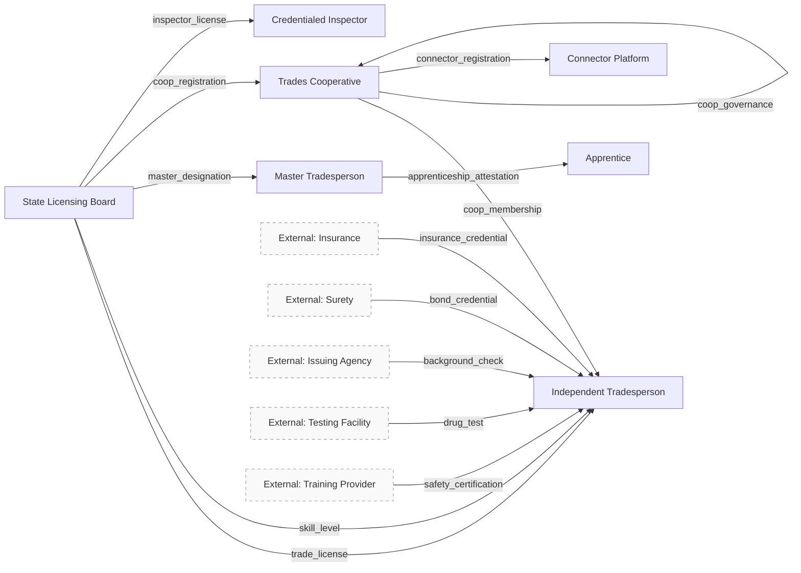
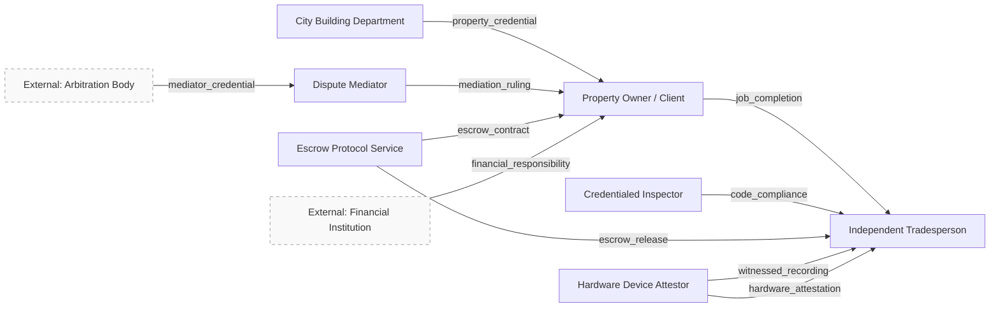
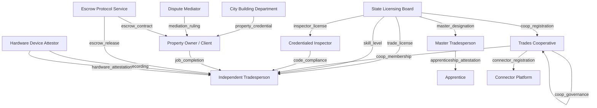
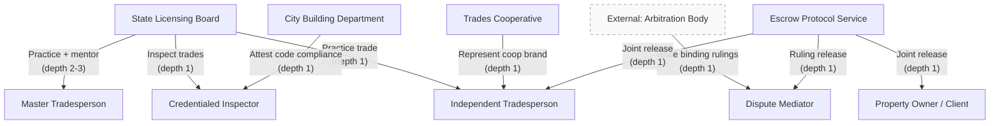
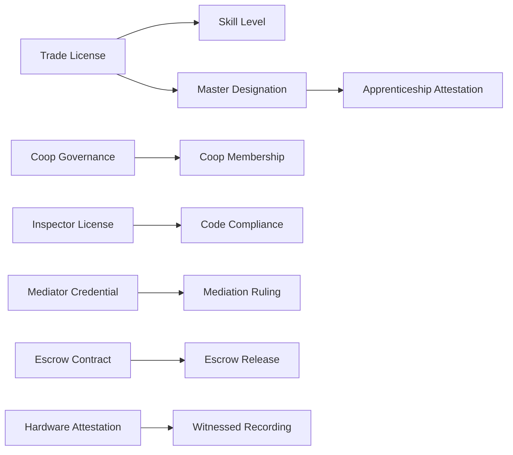

## What This Is

Right now, if you're a skilled plumber or electrician and you want to work independently, you have two options: hustle for every job yourself, or sign on with a general contractor who takes 40-60% of the revenue for the privilege of finding you work. Your license, your insurance, your skills — but their brand, their clients, their cut.

This ecosystem design replaces the general contractor middleman with a cooperative model. Independent tradespeople hold their own verifiable credentials — trade licenses, insurance, bonding, safety certifications — and contract directly with homeowners and cities. Job sequencing, credential verification, and code compliance are handled by the protocol, not by a boss. The cooperative provides community and collective bargaining, not administrative overhead. Workers capture the full value of their labor. Reputation is built through cryptographically attested job completions and travels with the worker — leave any coop and everything goes with you.

This is a C0 ecosystem design — a conceptual architecture, not a running system. Everything here maps to specific roles, credentials, and delegation trees defined in the [ecosystem YAML](https://github.com/seriouscoderone/kerihost/blob/main/docs/small-trades-cooperative/ecosystem.yaml). The diagrams below are generated from that specification.

## Roles

### Independent Tradesperson

Licensed skilled worker — plumber, electrician, HVAC tech, welder, carpenter, concrete worker — who holds their own credentials, contracts directly with clients, and builds portable reputation through attested job completions. The atomic unit of this ecosystem. May be an apprentice, journeyman, or master.

| Witness Pool | Watcher Network | Agent Service | ACDC Registry |
|:---:|:---:|:---:|:---:|
| No | No | Yes | No |

- Must maintain valid trade license for practiced trade category
- Must maintain current insurance and bonding credentials
- Must present credentials to homeowner and city upon request
- Must complete work to applicable building code standards

### Master Tradesperson

Highly experienced tradesperson who mentors apprentices and issues apprenticeship attestations. Their reputation compounds through their apprentices' success. Mentorship becomes a revenue stream — aging out of physical labor into teaching, with reputation as the product. Creates a verifiable lineage: who trained you, who trained them.

| Witness Pool | Watcher Network | Agent Service | ACDC Registry |
|:---:|:---:|:---:|:---:|
| No | No | Yes | Yes |

- Must hold master designation from licensing board
- Must maintain active practice or recent practice history
- Must accurately attest apprentice skill progression
- Reputation is staked on apprentice quality — poor apprentices reflect on mentor

### Apprentice

Tradesperson-in-training working under a master or journeyman. Holds an apprenticeship credential issued by their mentor and progresses to journeyman through attested experience and mentor sign-off. The old-school route for people who find a good mentor rather than trade school.

| Witness Pool | Watcher Network | Agent Service | ACDC Registry |
|:---:|:---:|:---:|:---:|
| No | No | Yes | No |

- Must work under supervision of credentialed mentor
- Must not practice independently beyond apprentice scope

### Trades Cooperative

Voluntary association of tradespeople with published membership requirements. Provides collective brand, shared marketing, group insurance rates, and peer community. Does NOT own members' credentials or capture their revenue — members leave with everything. Coops differentiate by their governance requirements: premium coops demand elite certifications, budget coops accept anyone with a valid license.

| Witness Pool | Watcher Network | Agent Service | ACDC Registry |
|:---:|:---:|:---:|:---:|
| Yes | Yes | Yes | Yes |

- Must publish governance framework publicly (membership requirements, standards)
- Must maintain witness pool with >= 3 witnesses
- Must verify member credentials on admission and monitor expiry
- Must not retain member credentials or reputation upon departure

### Property Owner / Client

Individual or entity contracting for trade services. Funds escrow, receives work completion, issues job completion attestations. The job completion attestation — not a review — is the atomic unit of tradesperson reputation. Low friction: just a confirmation that the job was done, signed as part of contract close-out.

| Witness Pool | Watcher Network | Agent Service | ACDC Registry |
|:---:|:---:|:---:|:---:|
| No | No | Yes | No |

- Must fund escrow before work begins
- Must attest job completion or initiate dispute within contract timeframe

### Credentialed Inspector

Licensed individual who verifies physical work against building code schemas. Can be government-employed or private. Private inspectors compete on speed, availability, and reputation — breaking the city inspector bottleneck. AI-assisted verification with hardware-attested images serves as a first pass; human inspector provides final attestation.

| Witness Pool | Watcher Network | Agent Service | ACDC Registry |
|:---:|:---:|:---:|:---:|
| No | No | Yes | Yes |

- Must hold valid inspector license from licensing board or city
- Must attest only within licensed inspection categories
- Must maintain impartiality — cannot inspect own work or employer's work
- Subject to audit/spot-check by city building department

### Dispute Mediator

Credentialed individual — often a retired master tradesperson or licensed arbitrator — agreed upon in contracts before work begins. Reviews audit trails, witnessed recordings, and KERI evidence chain to resolve disputes. Fee defined in escrow up front. Reputation built on ruling history and fairness track record.

| Witness Pool | Watcher Network | Agent Service | ACDC Registry |
|:---:|:---:|:---:|:---:|
| No | No | Yes | No |

- Must hold valid mediator credential from recognized arbitration body
- Must disclose any conflicts of interest before accepting a case
- Must render ruling within timeframe defined in contract
- Ruling history is public and contributes to reputation

### State Licensing Board

Government entity that issues trade licenses and defines licensing requirements. Trust anchor in the immature ecosystem. In the mature ecosystem, retains standard-setting and audit authority but is no longer the sole source of practitioner trust. Publishes licensing requirements as verifiable schemas.

| Witness Pool | Watcher Network | Agent Service | ACDC Registry |
|:---:|:---:|:---:|:---:|
| Yes | Yes | Yes | Yes |

- Must issue and maintain trade license credentials
- Must publish licensing requirements as verifiable schemas
- Must revoke credentials when licenses lapse or are suspended
- Must maintain public OOBI endpoints for verification

### City Building Department

Local government entity that publishes building code as verifiable schemas, accepts inspector attestations, and retains spot-check audit authority. Issues permits based on credential verification rather than manual paperwork review. Role shifts from inspection workforce to governance framework and quality audit.

| Witness Pool | Watcher Network | Agent Service | ACDC Registry |
|:---:|:---:|:---:|:---:|
| Yes | Yes | Yes | Yes |

- Must publish building code requirements as verifiable schemas
- Must accept attestations from credentialed inspectors
- Must maintain audit/spot-check program for inspector quality
- Must issue permits when credential requirements are met

### Connector / Recommendation Platform

Optional service that facilitates discovery between homeowners and tradespeople. Does NOT own reputation data — surfaces it. Competes on matching quality, not data lock-in. The organic, local alternative to Yelp and Angi. Deliberately lightweight with no infrastructure power accumulation.

| Witness Pool | Watcher Network | Agent Service | ACDC Registry |
|:---:|:---:|:---:|:---:|
| No | No | Yes | No |

- Must not store or claim ownership of tradesperson reputation data
- Must not gatekeep access to tradespeople
- Must present verifiable credentials, not proprietary ratings

### Escrow Protocol Service

Infrastructure that holds funds between contract signing and job completion. Releases on mutual attestation (both parties confirm) or mediator ruling. Cross-ecosystem primitive — the same escrow pattern applies to any industry with service contracts. Not owned by any single entity; operates as protocol infrastructure.

| Witness Pool | Watcher Network | Agent Service | ACDC Registry |
|:---:|:---:|:---:|:---:|
| Yes | Yes | Yes | Yes |

- Must hold funds securely and release only on defined trigger conditions
- Must support mutual attestation release and mediator ruling release
- Must publish transparent fee structure
- Must maintain audit trail of all escrow transactions

### Hardware Device Attestor

Manufacturer or certifier of devices (cameras, sensors) that produce hardware-attested images and recordings. Their credential proves the device produces authentic, unmodified, geolocated, timestamped media. Enables the physical-to-digital bridge that makes witnessed recordings admissible evidence.

| Witness Pool | Watcher Network | Agent Service | ACDC Registry |
|:---:|:---:|:---:|:---:|
| No | No | No | Yes |

- Must certify devices meet authenticity standards
- Must revoke attestation for compromised devices
- Must publish device certification standards

## Role Interaction Map

This ecosystem has 24 credentials flowing between 12 internal roles and 7 external entities. Split into two views for readability.

### Licensing, Training & Membership

Who qualifies whom to work. External entities (insurance, surety, testing) provide credentials that tradespeople carry into the ecosystem.

### Job Lifecycle

What happens when work gets done. Homeowners contract with tradespeople, inspectors verify, mediators resolve disputes, escrow handles the money.

## Credential Issuance Flow

Internal credential flows only (both issuer and holder are ecosystem roles), organized top-down by authority level.

## Delegation Trees

Authority flows from five roots. The licensing board is the primary trust anchor, delegating practice authority to tradespeople and inspection authority to inspectors. The city building department provides a parallel inspection authority path. Escrow release requires agreement from multiple parties.

Note that the inspector has two authority paths: from the licensing board and from the city building department. Both are valid. Master tradespeople have depth 2-3 delegation, meaning they can create apprenticeship lineages — who trained you, who trained them.

## Credential Dependency Graph

Credentials chain together through ACDC chaining. A trade license is the root for both skill level designations and master designations. The master designation unlocks the ability to issue apprenticeship attestations — creating a verifiable mentorship lineage.

Five independent chains: the **trade lineage chain** (license → skill level / master → apprenticeship) creates verifiable career paths. The **coop chain** (governance → membership) ties membership to published standards. The **job lifecycle chains** (inspector license → compliance, mediator → ruling, escrow contract → release, hardware → recording) each enable a specific step in the contracting workflow.

## Governance

This ecosystem operates within a well-established regulatory framework. State trade licensing codes define who can practice each trade. Local building codes (IBC/IRC) define what passes inspection. OSHA sets workplace safety standards. State contractor registration and surety bonding requirements provide financial protection. None of this is new — the ecosystem makes existing regulations verifiable and portable rather than replacing them.

Privacy is built into the credential architecture through selective disclosure. A tradesperson proves they're licensed without revealing their license number. They prove they're insured without exposing policy details, premiums, or claims history. Background checks are pass/fail only — no underlying details disclosed. Drug test results are disclosed to coop membership verification only, not to homeowners. Financial responsibility credentials show fundability, not bank balances. Witnessed recordings — hardware-attested photos and videos of work — are a locked box, opened only for dispute resolution. Workers control their own privacy gradient based on career stage and preference.

Disputes resolve through a graduated 5-filter model designed to catch problems at the lowest possible cost. **Filter 1** is clear contracts: scope, milestones, escrow amounts, estimate ranges, and a pre-designated mediator — most misunderstandings prevented here. **Filter 2** is verifiable attestations: inspection sign-offs, milestone completions, and timestamps make fault obvious. **Filter 3** is AI audit: automated analysis of the KERI audit trail catches non-obvious liability patterns. **Filter 4** is the credentialed mediator, pre-designated in the contract, reviewing audit trails and witnessed recordings to issue a binding ruling — fee comes from escrowed funds, defined up front. **Filter 5** is the traditional legal system as last resort, but the court receives a cryptographic evidence chain rather than conflicting testimony.

## Interoperability

### Insurance

Tradespeople carry insurance and surety bond credentials from the insurance ecosystem. The flow goes both ways — escrow history and dispute-free records may influence insurance premiums. A clean escrow release history is a signal for lower-risk pricing. Bridge credentials: `insurance_credential`, `bond_credential`.

### Financial

The homeowner's financial institution attests escrow fundability without revealing bank balances or account details. Credit-clearing networks (like MyCHIPs) serve as an alternative to traditional banking for payment settlement. Bridge credentials: `financial_responsibility`.

### Escrow Protocol

The escrow pattern is a cross-ecosystem primitive — the same contract-escrow-release workflow applies to any service industry. Mediator credentials are recognized across ecosystems. Bridge credentials: `escrow_contract`, `escrow_release`, `mediation_ruling`.

### Education & Training

Mentorship lineage credentials are portable across ecosystems. Apprenticeship attestations serve as an alternative to formal trade school credentials. Continuing education and safety certifications flow from training providers into the ecosystem. Bridge credentials: `apprenticeship_attestation`, `safety_certification`, `skill_level`.

---

*This is a C0 ecosystem design — a conceptual architecture, not a running system. See the [credential catalog](/ecosystems/small-trades-cooperative/credentials/) for the full credential specification.*

*Generated from [`docs/small-trades-cooperative/ecosystem.yaml`](https://github.com/seriouscoderone/kerihost/blob/main/docs/small-trades-cooperative/ecosystem.yaml) by the `/ecosystem-package` skill.*
